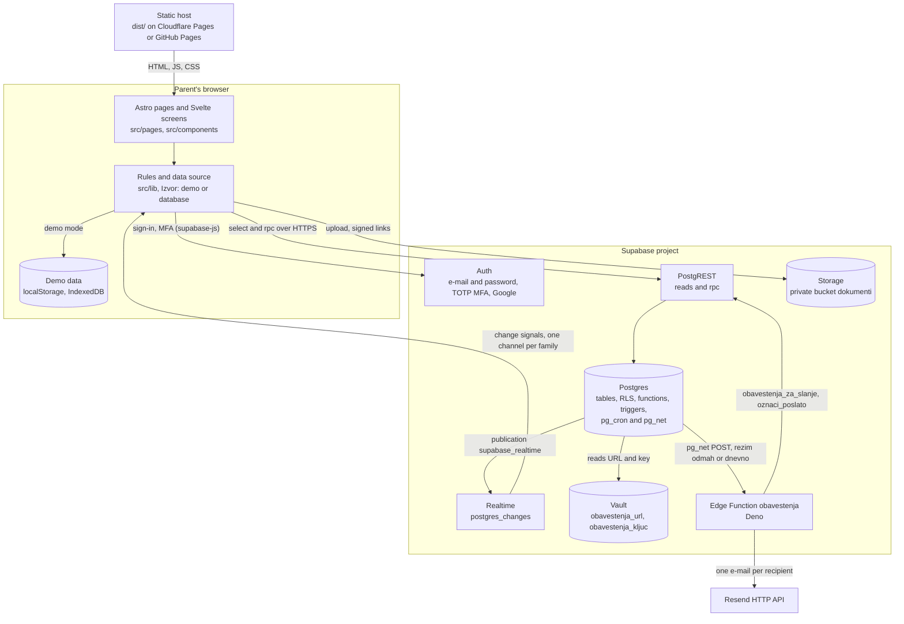

# Containers

The parts that run, and how they talk (from `src/lib/`, `supabase/migrations/`, `supabase/functions/` and
`.github/workflows/pages.yml`).

```mermaid
flowchart TB
  host["Static host<br/>dist/ on Cloudflare Pages or GitHub Pages"]
  resend["Resend HTTP API"]

  subgraph browser["Parent's browser"]
    screens["Astro pages and Svelte screens<br/>src/pages, src/components"]
    lib["Rules and data source<br/>src/lib, Izvor: demo or database"]
    demo[("Demo data<br/>localStorage, IndexedDB")]
  end

  subgraph supabase["Supabase project"]
    auth["Auth<br/>e-mail and password, TOTP MFA, Google"]
    api["PostgREST<br/>reads and rpc"]
    db[("Postgres<br/>tables, RLS, functions, triggers,<br/>pg_cron and pg_net")]
    storage[("Storage<br/>private bucket dokumenti")]
    realtime["Realtime<br/>postgres_changes"]
    vault[("Vault<br/>obavestenja_url, obavestenja_kljuc")]
    fn["Edge Function obavestenja<br/>Deno"]
  end

  host -- "HTML, JS, CSS" --> screens
  screens --> lib
  lib -- "demo mode" --> demo
  lib -- "sign-in, MFA (supabase-js)" --> auth
  lib -- "select and rpc over HTTPS" --> api
  lib -- "upload, signed links" --> storage
  realtime -- "change signals, one channel per family" --> lib
  api --> db
  db -- "publication supabase_realtime" --> realtime
  db -- "reads URL and key" --> vault
  db -- "pg_net POST, rezim odmah or dnevno" --> fn
  fn -- "obavestenja_za_slanje, oznaci_poslato" --> api
  fn -- "one e-mail per recipient" --> resend
```
