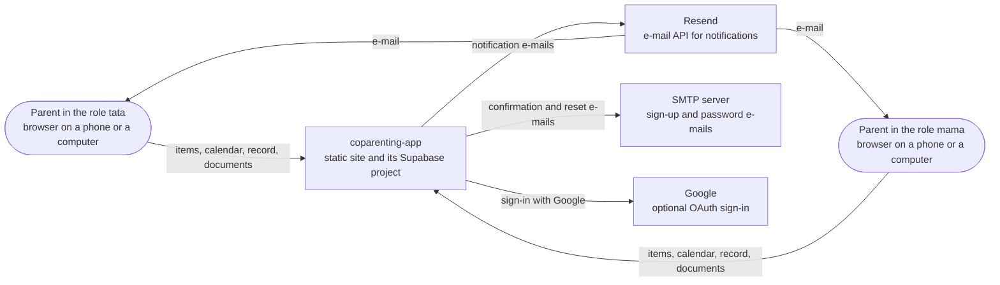

# Context

Who uses the app and which outside systems it talks to (from `src/lib/nalog.ts`, `supabase/config.toml` and
`supabase/functions/obavestenja/index.ts`).

```mermaid
flowchart LR
  tata(["Parent in the role tata<br/>browser on a phone or a computer"])
  mama(["Parent in the role mama<br/>browser on a phone or a computer"])
  app["coparenting-app<br/>static site and its Supabase project"]
  resend["Resend<br/>e-mail API for notifications"]
  smtp["SMTP server<br/>sign-up and password e-mails"]
  google["Google<br/>optional OAuth sign-in"]

  tata -- "items, calendar, record, documents" --> app
  mama -- "items, calendar, record, documents" --> app
  app -- "notification e-mails" --> resend
  resend -- "e-mail" --> tata
  resend -- "e-mail" --> mama
  app -- "confirmation and reset e-mails" --> smtp
  app -- "sign-in with Google" --> google
```
