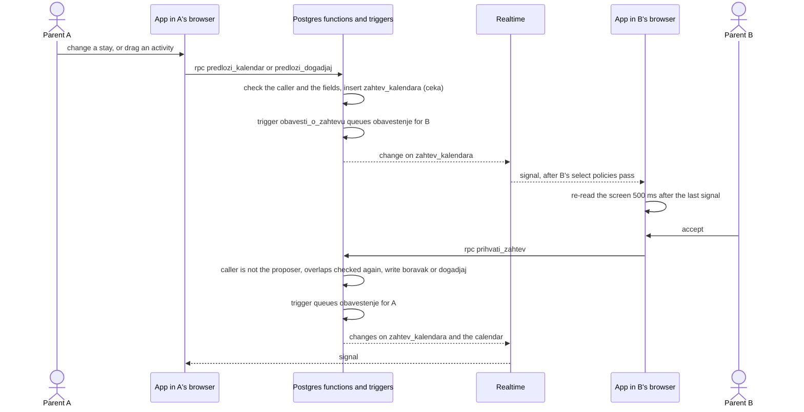

# A calendar proposal

How a change that needs the other parent's consent travels, here a calendar change (from
`src/lib/izvor-supabase.ts` and `supabase/migrations/`).

```mermaid
sequenceDiagram
  actor A as Parent A
  participant AppA as App in A's browser
  participant DB as Postgres functions and triggers
  participant RT as Realtime
  participant AppB as App in B's browser
  actor B as Parent B

  A->>AppA: change a stay, or drag an activity
  AppA->>DB: rpc predlozi_kalendar or predlozi_dogadjaj
  DB->>DB: check the caller and the fields, insert zahtev_kalendara (ceka)
  DB->>DB: trigger obavesti_o_zahtevu queues obavestenje for B
  DB-->>RT: change on zahtev_kalendara
  RT-->>AppB: signal, after B's select policies pass
  AppB->>AppB: re-read the screen 500 ms after the last signal
  B->>AppB: accept
  AppB->>DB: rpc prihvati_zahtev
  DB->>DB: caller is not the proposer, overlaps checked again, write boravak or dogadjaj
  DB->>DB: trigger queues obavestenje for A
  DB-->>RT: changes on zahtev_kalendara and the calendar
  RT-->>AppA: signal
```
